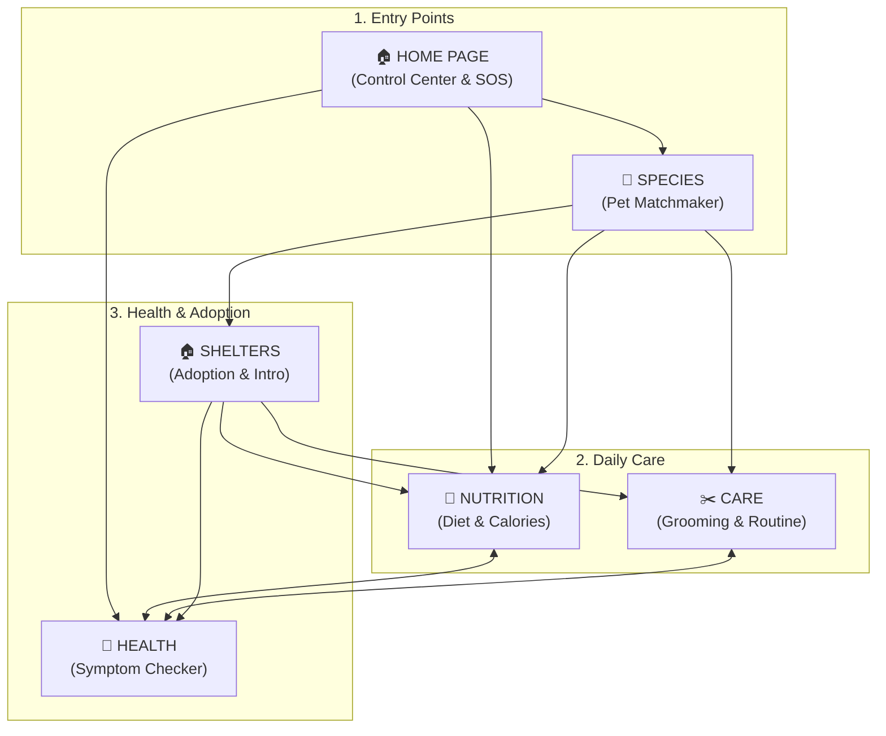

# PetCareWebMidTerm

Interactive PetCare web platform architecture and interconnections.

## 📐 Site Structure & Interconnections

---

### Page Interconnections & User Flow

#### 1. SPECIES → NUTRITION / CARE / SHELTERS
* **From a specific breed card (e.g., Corgi):**
  * **→ Nutrition:** Redirects directly to the specific diet requirements for Corgis (e.g., portion sizes, propensity to gain weight).
  * **→ Care:** Navigates straight to the grooming checklist for thick undercoats and short-leg hygiene.
  * **→ Shelters:** Displays a widget: *"Looking for a Corgi or a mixed breed? Here are similar pets currently available in local shelters."*

#### 2. NUTRITION ↔ HEALTH
* **Nutrition → Health:** If the food calculator detects a health issue (e.g., allergies or weight gain), it prompts a direct jump to the *"Digestive Health & Allergies"* section in **Health**.
* **Health → Nutrition:** Selecting a symptom like "dull coat" in the symptom-checker redirects the user to the *"Vitamins & Fatty Acids"* section in **Nutrition**.

#### 3. CARE ↔ HEALTH
* While browsing grooming routines (ear cleaning, nail trimming, brushing), contextual tooltips appear (e.g., *"How to spot an ear infection during cleaning?"*), leading directly to the **Health** section.

#### 4. SHELTERS → ALL PAGES
* Clicking **"Adopt Me"** triggers a step-by-step readiness checklist:
  * **Species:** Evaluates if the animal's temperament matches the lifestyle.
  * **Care:** Displays a starter pack checklist (beds, scratchers, shampoo).
  * **Nutrition:** Outlines the initial transition diet for shelter pets.
  * **Health:** Provides a first-vaccination and checkup guide for adopted pets.

#### 5. HOME PAGE (Central Hub)
* **Interactive "Day in the Life" Timeline:** Routes users based on daily routines:
  * *Morning Feeding* → Navigates to **Nutrition**.
  * *Midday Grooming* → Navigates to **Care**.
  * *Evening Health Check* → Navigates to **Health**.
* **SOS Quick Action:** Instantly links urgent symptoms to both **Health** and nearby **Shelters / Vet Clinics**.

---

### Global Connection: Persistent Pet Profile

When a user selects or creates a pet profile anywhere on the site (e.g., *"Cat, 2 years old, long hair"*), all 6 pages dynamically update their context:
* **Species** highlights traits specific to that breed.
* **Nutrition** calculates calorie intake for a 2-year-old cat.
* **Care** filters articles to focus on long-hair coat maintenance.
* **Health** adjusts vaccination and preventive care schedules for a 2-year-old.
